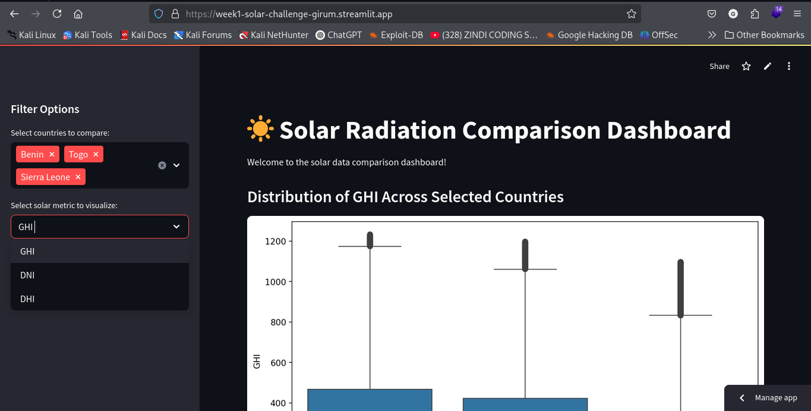

# ☀️ Solar Challenge Week 1: MoonLight Energy Solutions

Welcome to the repository for the Week 1 Challenge of the 10 Academy Fellowship, focused on analyzing solar radiation data across Benin, Sierra Leone, and Togo for MoonLight Energy Solutions.

---

## 🌍 Project Overview

As an Analytics Engineer, the goal is to help MoonLight Energy Solutions identify high-potential regions for solar installation by performing:

- Data profiling and exploratory analysis
- Statistical and cross-country comparisons
- Dashboard creation for interactive insights
- A reproducible and collaborative codebase

---

## 📦 Repository Structure

```

solar-challenge-week1/
├── .github/             # CI workflows
├── app/                # Streamlit dashboard code
│   ├── main.py
│   ├── utils.py
├── data/               # Raw and cleaned data (excluded from git)
├── notebooks/          # EDA and analysis notebooks
│   ├── benin\_eda.ipynb
│   ├── sierra\_leone\_eda.ipynb
│   ├── togo\_eda.ipynb
│   └── compare\_countries.ipynb
│   └── README.md
├── scripts/            # Documentation and auxiliary files
│   └── README.md
├── requirements.txt    # Project dependencies
├── .gitignore          # Files/folders to ignore
└── README.md           # This file

````

---

## 🔧 Setup Instructions

### 1. Clone the repository

```bash
git clone https://github.com/<your-username>/solar-challenge-week1.git
cd solar-challenge-week1
````

### 2. Create a virtual environment and install dependencies

Using `venv`:

```bash
python3 -m venv venv
source venv/bin/activate
pip install -r requirements.txt
```

Or with `conda`:

```bash
conda create -n solar-challenge python=3.10 -y
conda activate solar-challenge
pip install -r requirements.txt
```

---

## ✅ Tasks Completed

### ✅ Task 1: Git & Environment Setup

* GitHub repo initialized with `.gitignore`, `requirements.txt`, and GitHub Actions (`ci.yml`)
* Proper branching (`setup-task`) and meaningful commits
* CI configured to test dependency installation

### ✅ Task 2: EDA for Each Country

Performed exploratory data analysis for Benin, Sierra Leone, and Togo:

* Summary statistics & missing values
* Z-score-based outlier detection and cleaning
* Visualizations: time series, heatmaps, scatter plots, bubble charts, and cleaning impact
* Cleaned data exported (not committed)

### ✅ Task 3: Cross-Country Comparison

* Combined cleaned datasets
* Boxplots and summary tables for GHI, DNI, and DHI
* Statistical testing (ANOVA and Kruskal–Wallis)
* Insights summarized in markdown
* Visual rankings by average GHI

### ✅ Task 4: Streamlit Dashboard

* Interactive app to visualize solar metrics
* Users can select countries and metrics (GHI, DNI, DHI)
* Clean layout and intuitive controls
* Deployed on Streamlit Community Cloud

🔗 **Live Dashboard:** [week1-solar-challenge-girum.streamlit.app](https://week1-solar-challenge-girum.streamlit.app/)
#### 🖥 Dashboard Preview



---

## 📊 How to Run the Dashboard Locally

```bash
streamlit run app/main.py
```

* Make sure cleaned CSV files are placed inside the `data/` folder
* The dashboard supports selecting countries and metrics for boxplot comparison

---

## 📌 Notes

* Data files are not committed and must be placed in the `data/` directory manually
* CI/CD is enabled to validate the project environment
* Follows modular, clean coding and reproducibility practices

---

## 📚 License

This project is developed as part of the 10 Academy Fellowship and is intended for educational and evaluation purposes only.

---

## 🙌 Acknowledgments

Thanks to:

* 10 Academy team for mentorship and challenge curation
* MoonLight Energy Solutions (fictitious) for the business case
* The data engineering, ML, and analytics mentors for support